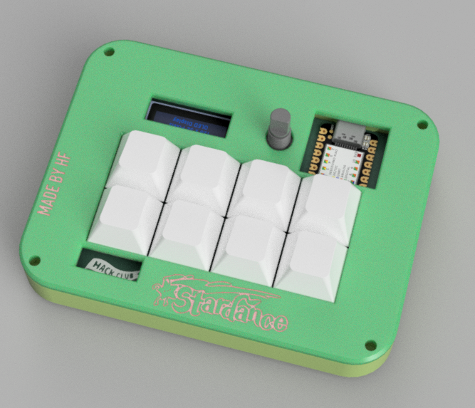
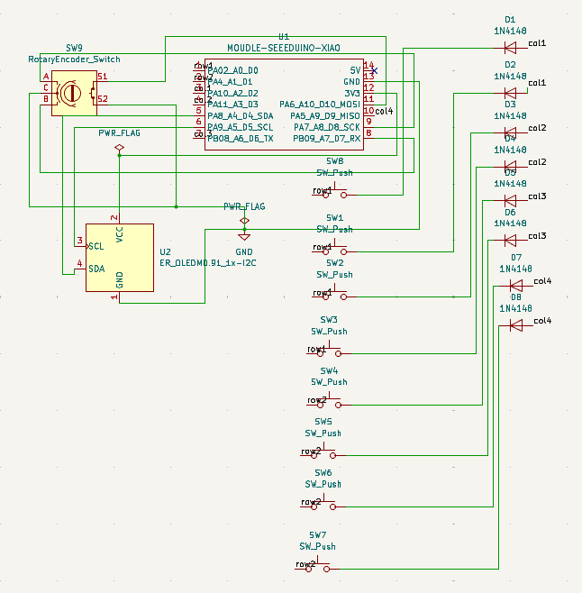
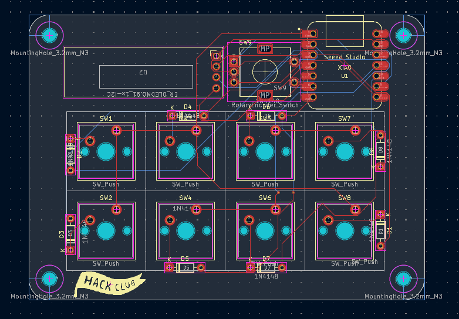
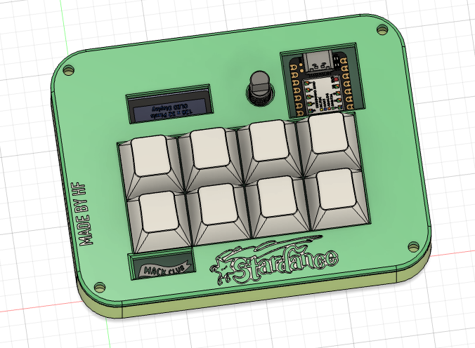

# My Awesome HackPad: 8-Key Macropad

This is my custom mechanical macropad I built from scratch in collaboration with Stardance and Hackclub. It features 8 programmable keys, a rotary encoder for volume adjustments, and an .91" oled display.



## Features

* **8 mechanical switches** for custom macro shortcuts
* **Rotary encoder** with push-button (volume control)
* **oled display** (128x32 I2C)
* **QMK-powered firmware**
* **USB-C connection**
* **Custom 3D-printed body**

## Interface

The macropad connects to the computer using a usb-c cable and acts as a standard keyboard, working with all operating sytems. The macros can be remapped without touching the hardware through the QMK firmware.

The oled display can show live status info and can be also be programmed to show other stuff as well, such as system stats, or custom text.

## 🧠 How It Works

The board is driven by a Seeeduino XIAO RP2040, soldered directly onto the PCB (made from scratch in Kicad). All of the 8 switches is wired in matrix, which is read by the microcontroller. The QMK firmware handles almost everything, with the only things that need configuring being the macros, the hackpad's hardware and metadata and the config.h file.

The rotary encoder and oled display are connected using GPIO pins on the XIAO:
* **Encoder:** Rotation: GP0, GP1, Push Switch: GP2
* **Oled (I2C):** SDA: GP4, SCL: GP6





## Hardware

* **Microcontroller:** Seeed XIAO RP2040
* **Switches:** 8× Mechanical key switches
* **Control:** 1× Rotary encoder with push-button
* **Display:** 0.91" 128x32 oled Display
* **PCB:** Custom 2-layer board designed in KiCad
* **Enclosure:** Custom 3D-printed body and top lid

## Project Structure

```text
my_awesome_hackpad/
├── CAD/
│   ├── hackpad_assembly.step
│   ├── case_top.step
│   └── case_bottom.step
├── PCB/
│   ├── hackpad.kicad_pro
│   ├── hackpad.kicad_sch
│   └── hackpad.kicad_pcb
├── Firmware/
│   └── my_awesome_hackpad/
│       ├── info.json
│       ├── config.h
│       ├── rules.mk
│       └── keymaps/
│           └── default/
│               └── keymap.c
├── production/
│   └── gerbers.zip
└── images/
    ├── hackpad_overall.png
    ├── schematic.png
    ├── pcb_layout.png
    └── case_assembly.pn
```

## Current Status

The project is still under development.

I've done:

* Designing PCB schematic
* PCB layout and routing
* Designing the case in Fusion 360
* Switch and encoder placement
* Case details
* QMK firmware setup

I have left:

* Parts sourcing
* Assembly
* Testing

## Design

The enclosure was 3d modeld in Autodesk Fusion around the layout of the pcb, with cutouts for the keys, the oled and the encoder, and one for the usb-c cable, as well. The enclosure also has some custom engraved text on the outside of the case.

The board layout keeps all 8 switches closely together, along with the oled and encoder positioned on the top for easier access.



## Built With

* KiCad
* Autodesk Fusion 360
* QMK Firmware
* 3D printing
* Collaboration with HackClub - Stardance

## 🤖 AI Usage

I used Claude during the making of this project:

- **KiCad help:** since this was my first time using the software, for help navigating the interface.
- **Code debugging:** fixing issues in the firmware.

The actual PCB design, case design, firmware logic, and assembly were done by me.

---
**Made by Harry Fanouriakis**
